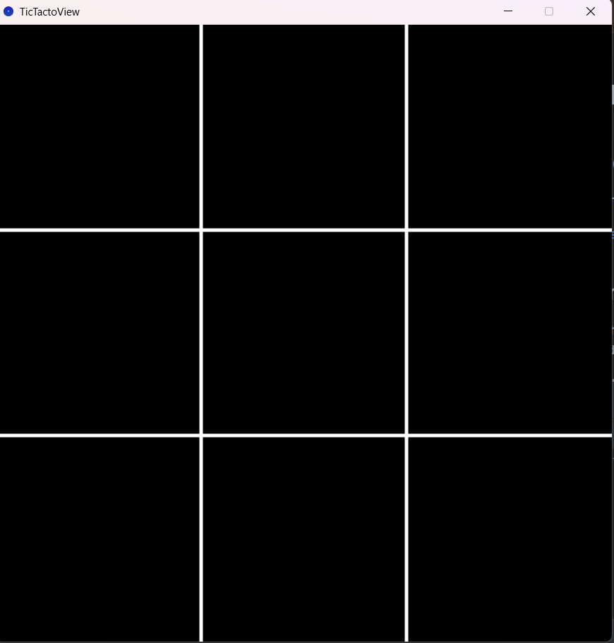
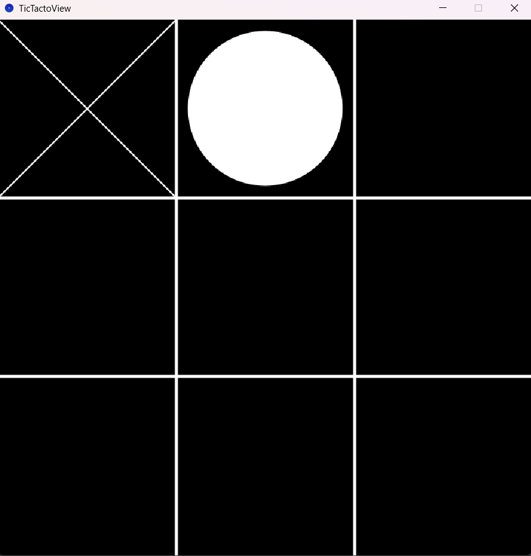
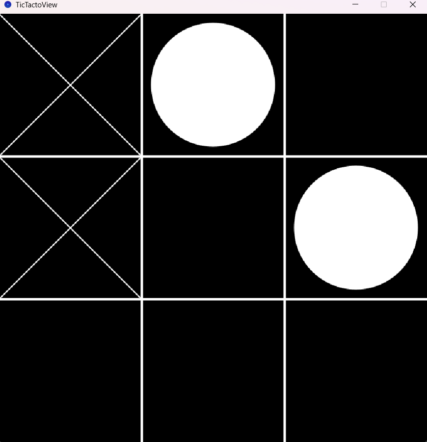
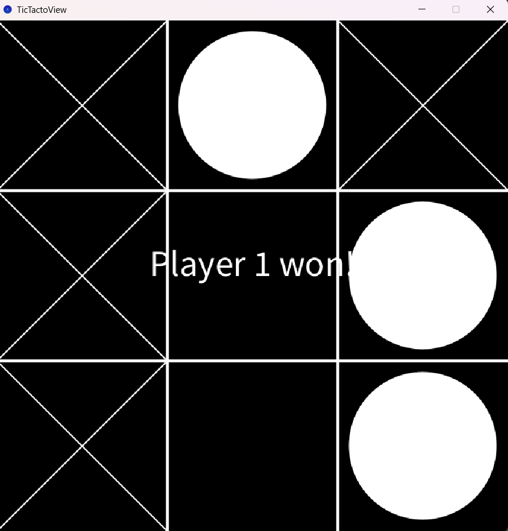
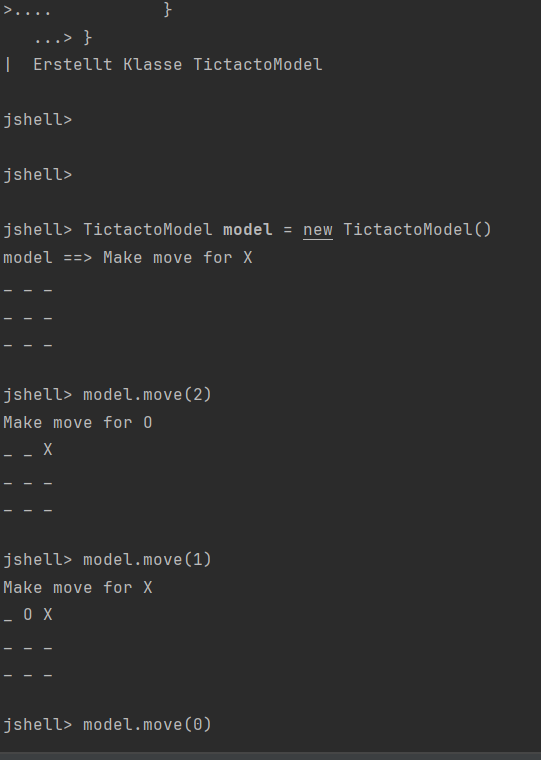

# Das TicTacToe-Spiel
Das **Tic-Tac-Toe-Spiel** ist ein Spiel, 
bei dem zwei Spieler abwechselnd eines von neun
Feldern auswählen und auf das gewählte Feld
klicken. Das Spielfeld sieht aus wie ein 
3x3-Gitter
. Wenn Spieler A auf ein Feld klickt,
erscheint ein 'X' und wenn Spieler B auf ein 
Feld klickt, erscheint ein 'O'. Der Gewinner 
ist derjenige, der als Erster drei seiner
Zeichen in einer Reihe,
Spalte oder Diagonalen positionieren kann.
Der Gewinner kann in dem Bildschirm gesehen werden.

## Verwndete Bibliotheken
Das Programm verwendet die fokgende Bibliotheke
- [Processing](http:/processing.org)

## Screenshots
EinScreenshot des laufendes Spieles im Dark-Mode :

## Startanleitung

Zum *Starten* müssen folgende Schritte beolgt werden :
1. Öffnen Sie die Datei`mains.java`
2. Starten der Funktion `main()`

## JShell Anleitung
1. Starten einer Konsole

## Das Spiel auf der Jshell testen
   TictactoModel model = new TictactoModel()

model.move(2)

model.move(1)

model.move(0)

